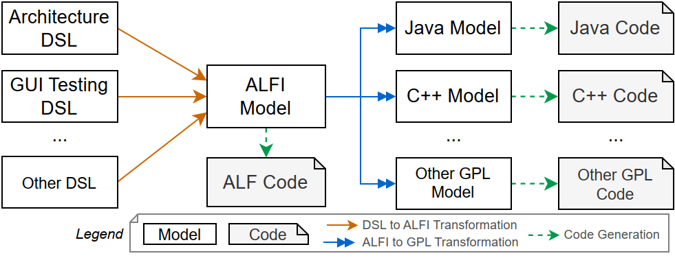

# ALFI Documentation

ALFI provides an intermediate transformation language to generate tailored DSLs to General Purpose Languages (GPLs) using JetBrains MPS, by supporting that DSL engineers only need to write a single transformation from the DSL to ALFI.
For this, ALFI is based on the UML ALF standard (Action Language for Foundational UML) and provides a textual representation of ALF.

## ALFI Process

The ALFI process distinguishes 4 phases for generating tailored DSLs (DSLs which are tailored to a specific domain):



1. **DSL Design**: The DSL designer creates a DSL in MPS and models of the DSL (e.g., an Architecture DSL, a GUI Testing DSL, ...).
2. **DSL to ALFI Transformation**: The DSL models are transformed into ALFI models. This includes usually that the DSL engineers write a transformation from the DSL to ALFI.
3. **ALFI to GPL Transformation**: The ALFI models are model-to-model transformed into one or multiple General Purpose Languages (GPLs) like Java or C++ (using MPS BaseLanguages). DSL engineers do usually not need to write any GPL-specific transformation logic, since this is part of the MPS ALFI project.
4. **GPL to Code Generation**: The GPL models are model-to-text transformed into code (using MPS TextGen) into code of target languages (e.g., `.java` or `.h`/`.cpp`).

## ALFI to GPL Transformations

### alfi.toJavaBaseLanguage

We use the Java BaseLanguage (MPS official) as a target for Java generation.

#### Optionals

Currently, we do not generate Java optionals for optional values, e.g., `Integer [0..1]` for simplicity reasons.
Since types (including boxed primitives like `Integer`) in Java can be `null`.
This will be improved in the future by generating `java.util.Optional` for optional values.

### alfi.toCppBaseLanguage

We use the CppBaseLanguage (https://github.com/Fumapps/CppBaseLanguage) as a target for C++ generation.
CppBaseLanguage (Fumapps) is a lightweight MPS base language, which supports basic C++ generation.

#### Optionals

We use std::optional for optional values, e.g., `Integer [0..1]`.
The generation of correct optionals is relying on `alfi.simplifyAlfiLanguage` (see below), which transforms ALFI programs into more simpler ones for optional handling.

### alfi.simplifyAlfiLanguage

This module provides an MPS transformation to simplify ALFI programs, mainly for optional handling:

* It detects optional chaining expressions and inserts intermediate variables to handle them more easily.
* It adds an explicit `== true` for optional booleans

Example:

```alf
WriteLine(BooleanFunctions::ToString(collection->at(1).booleanValue ?? false));

if (optionalBooleanValue) { 

} 
```

is transformed to

```alf
let helperVar_shvzm_a0a0a0a0w0a: BooleanHolder = collection->at(1); 
let helperVar_shvzm_a0a0a0a0v0a: Boolean = helperVar_shvzm_a0a0a0a0w0a.booleanValue; 
WriteLine(BooleanFunctions::ToString(helperVar_shvzm_a0a0a0a0v0a ?? false));

if (optionalBooleanValue == true) { 

} 
```

Used in:

* `alfi.toCppBaseLanguage`

## ALFI to .alf Transformation

To produce ALF code from ALFI, we generate the `TextGen` aspect using _TextGenGen_ (https://github.com/Fumapps/textGenGen fork).
It is based on the MPS editor definition of the ALFI language and supports model-to-text transformations.

# Compare Tests (alfi.compitest)

The `alfi.compitest` solution module contains tests to compare the output of the different generators.
It is used to ensure that the different generators produce the same output for the same input.

Languages which are compared:

* `alfi.toJavaBaseLanguage` (`.java`)
* `alfi.toCppBaseLanguage` (`.h,.hpp,.cpp`)
* `ALFI TextGen` (`.alf`)

It runs on every commit as a job in a GitHub Actions workflow: [`.github/workflows/workflow-build.yaml`](../.github/workflows/workflow-build.yaml)

[](https://github.com/vimotest/mps-alfi/actions/workflows/github-actions-integration.yaml)

## Compitest Example "Hello"

Here we show the example "Hello" in ALFI and the generated code in Java and C++.

**ALFI Example "Hello"**

```alf
activity Hello() { 
  WriteLine("Hello!");
  WriteLine("How are you?");
  let input: String = ReadLine();
  
  if (input == "good") { 
    WriteLine("Ok nice");
  } else { 
    WriteLine("Ok");
  }
}
```

**Java Example "Hello"**

```java
public class ActivityHello { 
  public static void Hello() {
    BasicInputOutput.WriteLine("Hello!"); 
    BasicInputOutput.WriteLine("How are you?"); 
    String input = BasicInputOutput.ReadLine();
    
    if (Objects.equals(input, "good")) { 
      BasicInputOutput.WriteLine("Ok nice");
    } else { 
      BasicInputOutput.WriteLine("Ok");
    }
  }
  public static void main(String[] args) {
    Hello();
  }
}
```

**C++ Example "Hello"**

```cpp
#include "ActivityHello.h" 
#include <BasicInputOutput.hpp > 
#include <string>

void ActivityHello::Hello( )
{
  alf::library::BasicInputOutput::WriteLine(std::string("Hello!")); 
  alf::library::BasicInputOutput::WriteLine(std::string("How are you?")); 
  std::string input = alf::library::BasicInputOutput::ReadLine();

  if (input == std::string("good"))
  {
    alf::library::BasicInputOutput::WriteLine(std::string("Ok nice"));
  }
  else
  {
   alf::library::BasicInputOutput::WriteLine(std::string("Ok"));
  }
}
```

## Compitest Example "Cars"

Have a look at the [Cars example](compitest/README.md) which contains PDF dumps and demonstrates structural modeling including inheritance.
